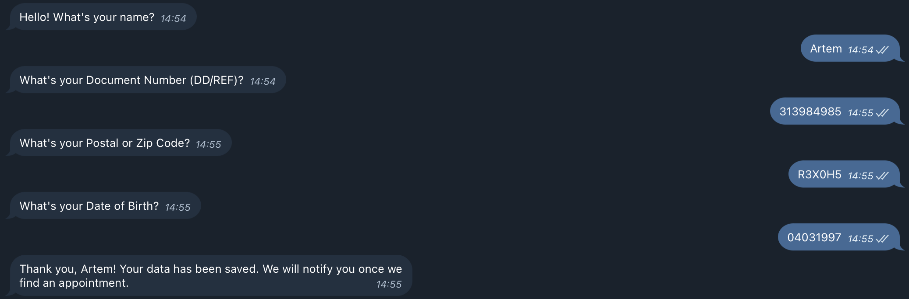

**This service automates booking available slots for road tests using a Telegram bot, eliminating the need for manual checks.**

---

---

## User Data Input

The user enters their information, such as document number, postal code, and birth date.

## Slot Availability Check

The service checks for available slots at regular intervals.

## Notifications

Available slots are sent directly to the user in the Telegram bot.

## Booking Confirmation

Once the user selects a slot, the service books it, and the confirmation is sent via Telegram.

---

  
# 📦 Features

  
**Configurable YAML File**: Allows customization of every step when interacting with the booking service.

**Full Logging**: Logs all service actions for transparency and debugging.

**Captcha Handling**: Supports solving captchas during the booking process.

**Customizable Check Intervals**: You can set how often the service checks for available slots.

**Concurrent Requests**: Supports handling multiple users asynchronously.

---

# 🤖 Customizable

The service is highly customizable and can be adapted to other booking services or workflows by modifying the configuration in the YAML file.

