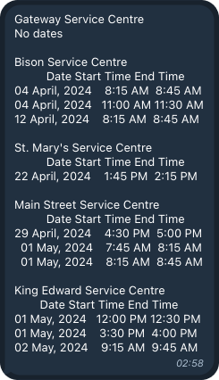

<div align="center">


**This service automates booking available slots for road tests using a Telegram bot, eliminating the need for manual checks.**

---


---


## User Data Input

The user enters their information, such as document number, postal code, and birth date.


## Slot Availability Check

The service checks for available slots at regular intervals.


## Notifications

Available slots are sent directly to the user in the Telegram bot.



## Booking Confirmation

Once the user selects a slot, the service books it, and the confirmation is sent via Telegram.


---


  
# 📦 Features

<div align="center">
  
**Configurable YAML File**: Allows customization of every step when interacting with the booking service.

**Full Logging**: Logs all service actions for transparency and debugging.

**Captcha Handling**: Supports solving captchas during the booking process.

**Customizable Check Intervals**: You can set how often the service checks for available slots.

**Concurrent Requests**: Supports handling multiple users asynchronously.

</div>

---

# 🤖 Customizable

The service is highly customizable and can be adapted to other booking services or workflows by modifying the configuration in the YAML file.

---

# 📖 Guidance

</div>

<div align="left">
  
## Table of Contents
1. [Setup](#setup)
2. [Usage](#usage)
3. [Algorithm Workflow](#algorithm-workflow)

## Setup

Follow these steps to set up the project:

1. **Clone the Repository:**
   ```bash
   git clone https://github.com/temashidzo/road_test_booking.git 
   cd road_test
   ```

2. **Create a Telegram Bot:**
  - Use BotFather to create a bot.
  - Save the API key provided by BotFather.

3. **Set Up the Database:**
  - Create a PostgreSQL database.
  - Add the necessary database credentials (see step 5).

4. **Install Dependencies:**
  - Ensure all dependencies are installed from requirements.txt:
    ```bash
    pip install -r requirements.txt
    ```
    
5. **Configure Environment Variables:**
  - Create a .env file in the root directory with the following credentials:
    ```plaintext
    TELEGRAM_TOKEN = 'your_telegram_token'
    DB_USER = 'your_db_user'
    DB_PASSWORD = 'your_db_password'
    DB_HOST = 'your_db_host'
    DB_PORT = 'your_db_port'
    DB_NAME = 'your_db_name'
    
    DB2_USER = 'your_secondary_db_user'
    DB2_PASSWORD = 'your_secondary_db_password'
    DB2_HOST = 'your_secondary_db_host'
    DB2_PORT = 'your_secondary_db_port'
    DB2_NAME = 'your_secondary_db_name'
    
    2CAPTCHA_API_KEY = 'your_2captcha_api_key'
    CAPTCHA_PAGE_URL = 'your_captcha_page_url'
    SITE_KEY = 'your_site_key'
    ```
6. **Configure Selenium Actions:**
  Update ```configs/config.yaml``` with the specific sequence of actions required for Selenium to interact with your booking service. This configuration will be used by src/mpi.py for automated interactions.

## Usage
To start the service:

1. **Launch the Telegram Bot:**
  - Run the following script to start the bot and create a new table in the database:
  ```bash
  bash scripts/telegram.sh
  ```
2. **Start the Booking Service:**
  - Run the following script to start the booking service:
  ```bash
  bash scripts/mpi_sel.sh
  ```
  - The service will spawn instances equal to the number of requests received from the Telegram bot and perform booking attempts based on stored data.

## Algorithm Workflow
Here’s a step-by-step explanation of the booking process, describing each participant’s role:

1. **User Initiation:**
  - A user opens the Telegram bot, presses "Start," and inputs their information as prompted by the bot.

2. **Data Storage:**
  - The bot saves all provided information into the database.

3. **Booking Attempt:**
  - The service reads the user data from the database and starts searching for available booking slots on the specified booking platform.
  - If captcha verification is required, the service uses the 2Captcha API to solve it.
4. **Notification:**
  - Upon finding an available slot, the service sends a notification to the user who requested it, including relevant details for confirmation.
   
</div>

---

<div align="center">
  
## 🧑‍💻 For more detailed instructions, contact me on [Telegram](https://t.me/temashidzo)

</div>

